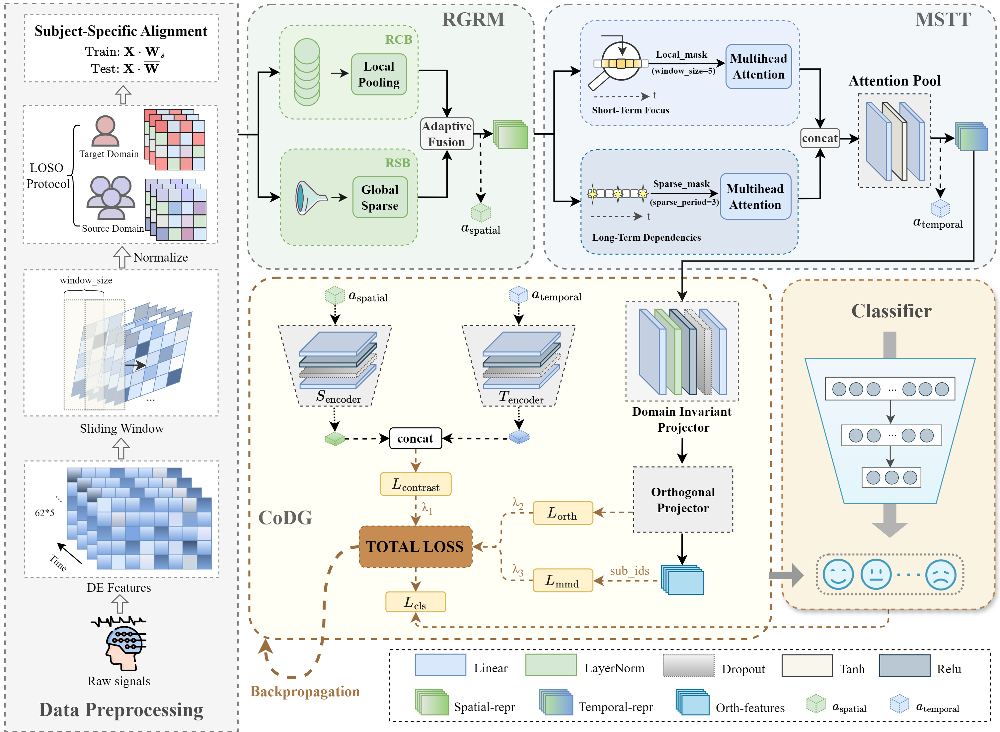

# RSM-CoDG: Region-aware Spatiotemporal Modeling with Collaborative DG



## Overview
RSM-CoDG is an EEG emotion recognition pipeline for the SEED-III (seed3) dataset. It combines:
- A region-aware graph module (RGRM) to model spatial structure across 62 EEG channels and 5 frequency bands.
- A multi-scale temporal transformer (MSTT) for local and sparse global temporal attention.
- A collaborative domain generalization head (CoDG) with complementary losses (attention sparsity, feature orthogonality, attention contrastive, MMD, class consistency) to improve cross-subject transfer.

Training follows leave-one-subject-out: each fold holds one subject out for testing while the remaining subjects are sources. TensorBoard logs and checkpoints are saved per fold.

## Project Layout
- `main.py` — CLI entry, experiment setup, LOSO loop.
- `train.py` — training routine, logging, early stopping, checkpointing.
- `test.py` — evaluation utilities.
- `model.py` — RGRM, MSTT, CoDG, and model wrappers.
- `preprocess.py` — SEED-III data loading and windowing utilities.
- `GradientReverseLayer.py`, `event.py` — auxiliary components/utilities.

## Environment
- Python 3.8+ (tested with PyTorch GPU)
- PyTorch, torchvision (CUDA build recommended)
- NumPy, SciPy
- scikit-learn (for optional detailed eval)
- tensorboard

Install (minimal):
```bash
pip install torch torchvision torchaudio --extra-index-url https://download.pytorch.org/whl/cu121
pip install numpy scipy scikit-learn tensorboard
```

## Data Preparation (seed3 only)
1. Set `--seed3_path` to the root directory containing SEED-III DE features and labels.
2. Expected structure:
```
<seed3_path>/
  label.mat
  1/<subject>_<...>.mat
  2/<subject>_<...>.mat
  3/<subject>_<...>.mat
```
- `session` selects the subfolder (`1`, `2`, or `3`).
- Each `.mat` under a session contains keys starting with `de_LDS*` (62 channels × 5 bands × time). `label.mat` holds session labels.

## Running Training (LOSO)
Example (session 1, batch 512, default hyperparameters):
```bash
python main.py \
  --dataset_name seed3 \
  --session 1 \
  --seed3_path /path/to/seed3/ \
  --way RSM-CoDG/seed3 \
  --index RSMCoDG_512 \
  --batch_size 512 \
  --epoch_training 200 \
  --lr 1e-4 --weight_decay 5e-4
```
Key flags:
- `--way`, `--index`: tag TensorBoard and checkpoint folders.
- `--dg_warmup_epochs`, `--dg_max_weight`: schedule DG losses.
- `--weight_*`: weights for the five DG losses.
- `--patience`: early stopping patience.

Outputs:
- TensorBoard logs: `data/session<session>/<way>/<index>/`
- Checkpoints/config: `model/<way>/<index>/` (`*_rsm_codg_model.pth`, `*_config.json`)

## Evaluation
During training each fold is evaluated on the held-out subject every epoch; best checkpoints per fold are stored. For standalone testing of a saved model, use the helpers in `test.py` (e.g., `test_rsm_codg`).

## Citation
If you use RSM-CoDG in your research, please cite the corresponding paper (add once available).
